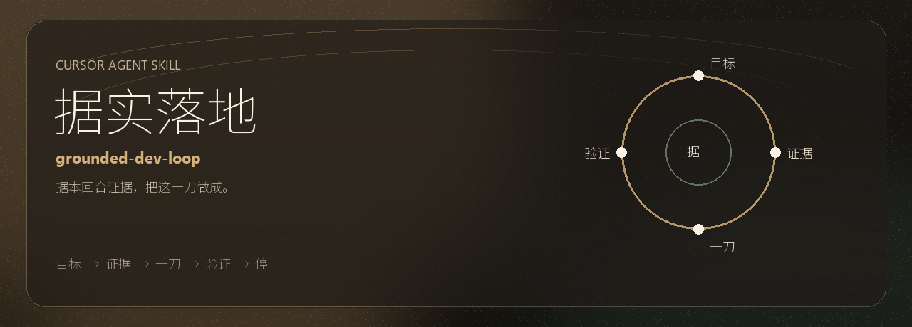

<p align="center">
  <strong>中文</strong> · <a href="README.en.md">English</a>
</p>

<p align="center">
  
</p>

<p align="center">
  <a href="LICENSE"></a>
  
</p>

<p align="center">
  <a href="#做什么">做什么</a> ·
  <a href="#怎么用">怎么用</a> ·
  <a href="#撰稿人">撰稿人</a> ·
  <a href="#许可证">许可证</a>
</p>

> Cursor 专用的 Agent Skill。长对话里编码和排障容易漂：目标被换成史诗，聊天摘要被当成事实，一刀改动碰到不该碰的面。据实落地把这一轮做成状态机：模型填写账本并判断当前状态，`scripts/next-state.py` 按守卫选出下一步。

## 做什么

| 锁住 | 不做什么 |
| --- | --- |
| 用用户这一轮的话写目标 | 把上一轮助手的结论当成证据 |
| 只选一个模式：investigate / debug / implement / refactor | debug 时顺手重构 |
| 工作集尽量不超过 7 个符号，只限制写入 | 用停规则跳过已点名的复现；改没点名的数据、密钥、生成物 |
| 在用户会碰到的入口上验证 | 改测试 expected 换绿 |

正文在 [SKILL.md](SKILL.md)。反例在 [reference.md](reference.md)，短例在 [examples.md](examples.md)。

## 怎么用

克隆到 Cursor 的个人 skills 目录：

```bash
git clone https://github.com/KK-Skyline/grounded-dev-loop.git "$HOME/.cursor/skills/grounded-dev-loop"
```

Windows PowerShell：

```powershell
git clone https://github.com/KK-Skyline/grounded-dev-loop.git "$env:USERPROFILE\.cursor\skills\grounded-dev-loop"
```

对话里说「据实落地」或 `@grounded-dev-loop`。机器 id 是 `grounded-dev-loop`。

改过中文文件后，在仓库根目录跑：

```text
python scripts/assert-utf8.py
```

它检查 Markdown / JSON 是否为带 BOM 的 UTF-8，以及标题「据实落地」没有被系统 ANSI 写花。

## 撰稿人

- **院长**（[KK-Skyline](https://github.com/KK-Skyline)）
- **Grok**（xAI）

技能正文、边界、示例和编码约束是两人在 Cursor 里一起写成的。Grok 没有 GitHub 账号，进不了 Contributors 图，所以写在这一节。

做成于 2026-09-18。当时的 Cursor 对话标题是 “Excel file modification instructions”（id `b2acdcd0-9a49-43fd-bb77-f1a67382df1f`），工作区是 pallet-tool。同日后续把中文名定为「据实落地」，并加上 UTF-8 BOM 约束。

## 许可证

[CC BY-NC 4.0](LICENSE)（署名-非商业性使用 4.0）。

可以复制、转载、修改、再分发。转载时保留署名，并注明改动。**禁止商业使用。** 除此之外不再附加限制。

法律全文：<https://creativecommons.org/licenses/by-nc/4.0/legalcode>
